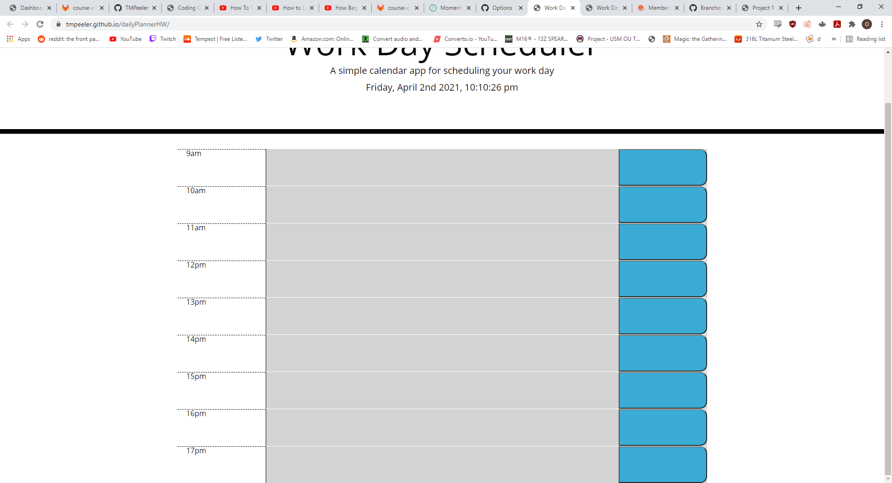

# DailyPlannerHW

The purpose of this assignment was to make a daily planner that saved user input and color coded the time slots so that on reload it will save user input and display the current time as well as show colors based on its relation to the current time.

## Getting Started

I started a fresh repo and started generating all my files, then I started pseudocoding and taking notes about what functions and steps I needed to take in order to solve the problem. Something interesting about this homework that wasn't part of the challenges of the other homework was making sure that I grabbed all the correct values in the correct places and using a few tools I hadn't really put my hands on yet.

### Prerequisites

In order to accomplish the goal of this assignment, I had to use VSCode for the HTML but particularly JavaScript as well as Gitbash for moving files between my repository and local machine. I also used Github to create the repository that I was sending to. This assignment also called for CSS for styling the elements that I appended and created via javascript in the HTML. Another tool necessary to solve this particular assignment was the use of moment.js to find the time values and to delegate those values into functions that helped my page work as necessary.

### Solving

The creation of the daily planner was a problem that seemed less challenging to solve but actually proved to be somewhat difficult in surprising ways. A lot of my planner was actually hard coded into the HTML and JS variables which made some things very difficult and some things very quick. I basically just made a bunch of divs that were for each actiivity and time slot, text box, and button were included inside. If I dynamically generated the time slots and buttons it would have been far easier to just iterate through all the dynamically generated elements via index and arrays instead of having to parse the number value out of the time slots that I hard coded. Then I added the functionality of the localstorage by making each button related to its respective textarea and then saving the textarea value to the local storage. Then I have a function that parses the number value of each div in military time and compares it to the current hour value of my moment.js and says that if the hours are the same then it's the present, if the hours are smaller it's the past, and if the numbes is larger then it's the future.

## Technologies Used

* [HTML](https://developer.mozilla.org/en-US/docs/Web/HTML)
* [JS](https://www.javascript.com/)
* [CSS](https://developer.mozilla.org/en-US/docs/Web/CSS)
* [Moment](https://momentjs.com/)

## Deployed Link

* [https://tmpeeler.github.io/dailyPlannerHW/](#)

## Code snippet of important work:
this snippet is what determines the time that I'm targeting as well as the time that it currently is and does the logical gate for determining which zones are past, present, and future.

        var hourText = parseInt($(this).text().trim());
        console.log(hourText);
        if (hourText < currentTime) {
            $(this).parent().addClass("past");

        } else if (hourText === currentTime) {
            $(this).parent().removeClass("past");
            $(this).parent().addClass("present");

        } else if (hourText >= currentTime) { 
            $(this).parent().removeClass("past");
            $(this).parent().removeClass("present");
            $(this).parent().addClass("future");
        }
    });
}

## Picture of website currently deployed

;

## Authors

* **Thomas Peeler** 

- [https://github.com/TMPeeler/dailyPlannerHW]

## Acknowledgments

* Thanks to my tutor and my fellow classmates as well as Mahi for helping me several times during office hours on finding and coming up with the exact syntax that I needed to solve my problems.